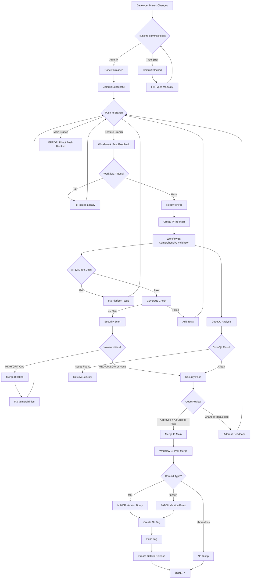

# CI/CD Workflow Diagrams

## Complete Flow

```
Developer → Local → Cloud → Production
```

## Detailed Flow Diagram



## Workflow A: Feature Branch Fast Feedback

```
┌──────────────────────────────────────────────────────────┐
│ Trigger: push to feature/*                                │
└──────────────────────────────────────────────────────────┘
                         │
        ┌────────────────┼────────────────┐
        │                │                │
        ▼                ▼                ▼
┌──────────────┐  ┌──────────────┐  ┌──────────────┐
│   Ubuntu     │  │   Windows    │  │    macOS     │
│  (latest)    │  │  (latest)    │  │  (latest)    │
│ Python 3.12  │  │ Python 3.12  │  │ Python 3.12  │
└──────────────┘  └──────────────┘  └──────────────┘
        │                │                │
        └────────────────┼────────────────┘
                         │
                         ▼
                  ┌─────────────┐
                  │  3-5 min    │
                  │  ✓ Lint     │
                  │  ✓ Types    │
                  │  ✓ Tests    │
                  └─────────────┘
```

**Jobs**: 3
**Time**: 3-5 minutes
**Purpose**: Quick validation

## Workflow B: PR to Main Comprehensive

```
┌──────────────────────────────────────────────────────────┐
│ Trigger: pull_request → main                              │
└──────────────────────────────────────────────────────────┘
                         │
        ┌────────────────┼────────────────┐
        │                │                │
        ▼                ▼                ▼
┌─────────────────────────────────────────────────────────┐
│           Matrix: 6 OS × 2 Python = 12 Jobs              │
├─────────────────────────────────────────────────────────┤
│ ubuntu-latest  × [3.12, 3.13]  = 2 jobs                  │
│ ubuntu-22.04   × [3.12, 3.13]  = 2 jobs                  │
│ windows-latest × [3.12, 3.13]  = 2 jobs                  │
│ windows-2022   × [3.12, 3.13]  = 2 jobs                  │
│ macos-latest   × [3.12, 3.13]  = 2 jobs                  │
│ macos-14       × [3.12, 3.13]  = 2 jobs                  │
└─────────────────────────────────────────────────────────┘
        │                │                │
        └────────────────┼────────────────┘
                         ▼
                  ┌─────────────┐
                  │  + Security │
                  │  + CodeQL   │
                  │  + Coverage │
                  └─────────────┘
                         │
                         ▼
                  ┌─────────────┐
                  │ 10-15 min   │
                  │ 15 Checks   │
                  └─────────────┘
```

**Jobs**: 13 (12 matrix + 1 security)
**Time**: 10-15 minutes
**Purpose**: Production-ready validation

## Workflow C: Post-Merge

```
┌──────────────────────────────────────────────────────────┐
│ Trigger: push to main (after PR merge)                    │
└──────────────────────────────────────────────────────────┘
                         │
                         ▼
                 ┌───────────────┐
                 │ Check Commit  │
                 │ Type          │
                 └───────────────┘
                         │
        ┌────────────────┼────────────────┐
        │                │                │
        ▼                ▼                ▼
    ┌──────┐        ┌──────┐       ┌──────┐
    │ feat │        │ fix  │       │chore │
    │ MINOR│        │PATCH │       │ skip │
    └──────┘        └──────┘       └──────┘
        │                │                │
        └────────────────┼────────────────┘
                         │
                         ▼
                 ┌───────────────┐
                 │  cz bump      │
                 │  Update files │
                 │  Create tag   │
                 │  Push changes │
                 └───────────────┘
                         │
                         ▼
                 ┌───────────────┐
                 │ GitHub        │
                 │ Release       │
                 └───────────────┘
                         │
                         ▼
                      [DONE]
```

**Jobs**: 1
**Time**: 1-2 minutes
**Purpose**: Automated versioning

## Security Analysis Flow

```
┌──────────────────────────────────────────────────────────┐
│ PR to Main OR Weekly Schedule                             │
└──────────────────────────────────────────────────────────┘
                         │
        ┌────────────────┼────────────────┐
        │                                 │
        ▼                                 ▼
┌─────────────────┐              ┌─────────────────┐
│ CodeQL: Python  │              │ CodeQL: JS/TS   │
│ semantic analysis│              │ semantic analysis│
└─────────────────┘              └─────────────────┘
        │                                 │
        └────────────────┬────────────────┘
                         │
                         ▼
                 ┌───────────────┐
                 │ Security Tab  │
                 │ Alerts        │
                 └───────────────┘
                         │
                         ▼
              ┌──────────────────────┐
              │ Block HIGH/CRITICAL  │
              │ Warn MEDIUM/LOW      │
              └──────────────────────┘
```

## Developer Journey

```
Day 1: Feature Development
├─ 1. Create branch
├─ 2. Write code
├─ 3. Commit (pre-commit runs)  ← 10 sec
├─ 4. Push to branch
└─ 5. Wait for Workflow A        ← 3-5 min

Day 2: PR Creation
├─ 1. Create PR to main
├─ 2. Wait for Workflow B        ← 10-15 min
├─ 3. Wait for CodeQL            ← running in parallel
├─ 4. Fix any issues found
└─ 5. Request review

Day 3: Merge
├─ 1. Review received
├─ 2. All 15 checks pass
├─ 3. Merge PR
├─ 4. Workflow C runs            ← 1-2 min
└─ 5. Release created!
```

---

## ASCII Diagram (Terminal-Friendly)

```
                  Developer Workflow
                         |
                         v
        ╔════════════════════════════════╗
        ║   Pre-commit Hooks (<10s)      ║
        ║   - Format  - Lint  - Types    ║
        ╚════════════════════════════════╝
                         |
                         v
        ╔════════════════════════════════╗
        ║  Workflow A: Feature (3-5m)    ║
        ║  [Ubuntu] [Windows] [macOS]    ║
        ║  Python 3.12 only              ║
        ╚════════════════════════════════╝
                         |
                         v
        ╔════════════════════════════════╗
        ║ Workflow B: PR to Main (10-15m)║
        ║ 6 OS × 2 Python = 12 jobs      ║
        ║ + Security + CodeQL + Coverage ║
        ╚════════════════════════════════╝
                         |
                         v
        ╔════════════════════════════════╗
        ║ Workflow C: Post-Merge (1-2m)  ║
        ║ Version bump + Release         ║
        ╚════════════════════════════════╝
                         |
                         v
                  🎉 Production!
```

---

**Last Updated**: October 20, 2025
**Maintained By**: Iris Development Team
